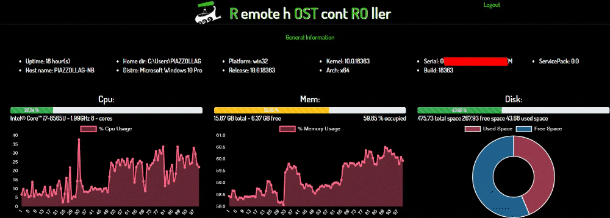
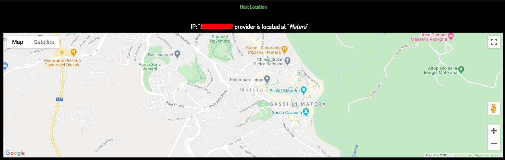
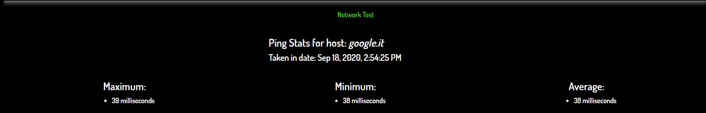
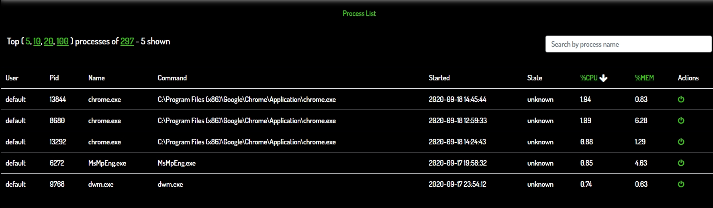

# Rostro - Remote hOST contROller

Simple cross-platform Host monitoring web tool written in Angular and Node.js.

Yep it's a remote web based task manager! What does it do ?
 
* Shows general informations about the host like CPU , % RAM , % HDD in very nice graphs ( yes I know the rest of the GUI sucks very bad ) 
* Shows all processes and give user the possibility to KILL ( O_O )
* Shows the host location and the network status ( just a ping to google );
* Retains in no-sql mongo DB hardware information about the host;
* Backend calls are secured trough JWT;  

TODO:
* You can install it your mobile phone and get access to push warning notification about the host status ;
* Configure and Send mails/ warning push notification if a threshold is surpassed eg: CPU temperature, 
  RAM completely full for too long, HDD with not enough space, ip address not reachable;
* See History Graphs about the host, when the most critical workload had occurred, what processes where active in that moment etc.
* See network latency graphs;   

### DEMO 

#### General info

#### Host Location

#### Networking

#### Processes

### HOW TO INSTALL

* Install a mongodb on your machine, next configure the connection in server/config/*.json;
* Configure username and password for your application in server/config/*.json;
* Add an environment.prod.ts inside client/environment with the googleApiKey;

### HOW TO RUN

* SERVER

1) dev: cd server && npm install && npm start
2) prod: pm2 start server.js ( pm2 is a great tool! )

* CLIENT
1) dev: cd client && npm install && ng serve
2) prod: ng build --prod; and serve directory in your favorite web server

